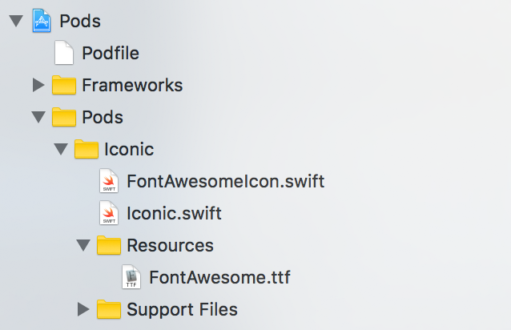
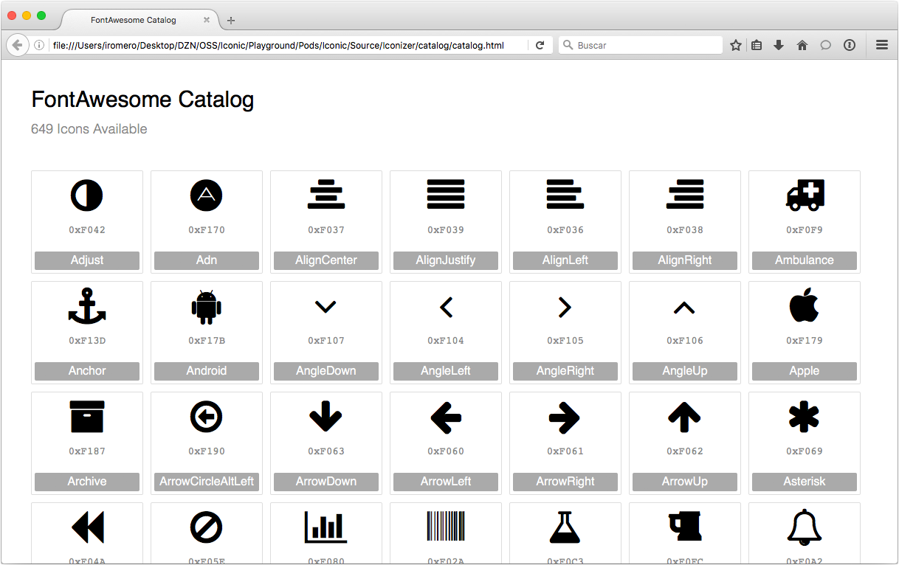

[](https://travis-ci.org/dzenbot/Iconic/builds)
[](http://cocoadocs.org/docsets/Iconic/)
[](http://opensource.org/licenses/MIT)


**Iconic** will help making icon fonts integration effortless on iOS. Its main component is in charge of auto-generating strongly typed Swift code, fully compatible with Objective-C.

You will interact with an auto-generated class under the name of `{FontName}Icon.swift`, which is a light abstraction of the `Iconic.swift` class. For more information, have a look at [how to install](#installation) and [how to use](#how-to-use).

_Note: This library is currently in beta. APIs may change without backwards compatibility._

<p align="center">

</p>


## Why Icon Fonts
Web developers have been using icon fonts for quite some time now.

#### There are many advantages of using icon fonts on iOS:
- Resolution independent: scale and tint without quality loss.
- Automatically scaled for different screen densities.
- Work with (way) less image files.
- Improve visual consistency.
- Platform agnostic. 
- Add better UI accessibility.
- Simple to work with.

#### Where can I find awesome icon fonts?
- Check out the [icon fonts available in this repo](./Fonts)!
- There are many [open sourced icon fonts](http://fontello.com/) out there (most are available under the [SIL Open Font License](http://scripts.sil.org/OFL)). They are designed for the web but they are still very useful for iOS.
- You can ask your nearest friendly designer! Making an icon font isn't that hard, specially if you already have the assets.
- You can [read this article](http://rafaltomal.com/how-to-create-and-use-your-own-icon-fonts/) and give [fontastic.me](http://fontastic.me/) a shot.


## Key Features
- [Very easy to install with CocoaPods](#installation).
- Compatible with Swift and Objective-C.
- Supports TTF and OTF font files.
- Auto-generates enums and unicodes mapping, out of the font's [PUA range](https://en.wikipedia.org/wiki/Private_Use_Areas).
- `NSAttributedString` and `UIImage` outputs.
- Fonts are registered dynamically, effortless. No need to import the file to your project.
- [UIKit extensions](#uikit-extensions) (`UIBarButtonItem` and `UITabBarItem`).
- Auto-generated [icon font html catalog](#icon-font-catalog).
- Interface Builder support (prototype).
- iOS 8, and tvOS 9 or later.

_Note: Some open sourced icon fonts don't include the names of each of their glyphs. This could result in a non-descriptive enum, which can make things less intuitive for you when using Iconic. If you create your own icon font, make sure to properly name each glyph._


### Missing Features in Beta
- [ ] Interface Builder Support.
- [ ] Solid API definition with a more Swifty approach (see #2 and #26).
- [ ] Fully covered with snapshot tests.


## Installation

#### Via CocoaPods
```ruby
FONT_PATH='path_to_your_icon_font.ttf' pod install

FONT_PATH='path_to_your_icon_font.ttf' pod update Iconic
```
When using the `FONT_PATH` environment variable, CocoaPods will install Iconic with a custom icon font and auto-generate all files with its name.

```ruby
pod install Iconic
```
Will install Iconic with its default font, [FontAwesome](https://github.com/FortAwesome/Font-Awesome).

After the installation, you should see a similar setup like this:



### Under the hood
When installing Iconic, several things are happening:
- After the Iconic repo is cloned, a custom version of [SwiftGen](https://github.com/DZNLabs/SwiftGen) is downloaded along with its dependencies.
- Before pods are installed, `SwiftGen` is compiled
- [Iconizer](Source/Iconizer/Iconizer.sh) is ran, executing `SwiftGen` using a [custom stencil for Iconic](Source/Iconizer/iconic-default.stencil).
- `SwiftGen` does its magic, detecting all unicodes from the [PUA range](https://en.wikipedia.org/wiki/Private_Use_Areas) of the provided font file, extracting their unicode values as well as their glyph names. All this data is then used for auto-generating a Switft class of name `{FontName}Icon.swift`; a json file is also exported afterwards.
- Once everything is exported, an [HTML icon font catalog](#icon-font-catalog) is also created.  

There is a known bug where sometimes, calling `pod install Iconic` would not run correctly SwiftGen an retrieve all the icon unicode from a font. If this happens to you, make sure to call `pod update Iconic` to retrigger SwiftGen.


## How to use
For complete documentation, visit [CocoaPods' auto-generated docs](http://cocoadocs.org/docsets/Iconic/).

### Import
Import the Iconic module:
##### Swift
```swift
import Iconic
```
##### Obj-C
```objc
@import Iconic;
```

### Registering the icon font
Registration is required to activate Iconic. You shall do this once, when launching your application. Internally, the icon mapping is retrieved and kept in memory during the application's life term.

Iconic provides a convenient way to register the icon font:
Note: the method name may change depending of your icon font's name:
```swift
Iconic.registerIconFont()
```

### Use as images
You can construct an `UIImage` instance out of a font's icon and tint it. This may be very convenient for integrating with existing UIKit controls which expect `UIImage` objects already.
```swift
let image = Iconic.image(forIcon: .Home, size: 20, color: .blueColor())
```

Images are created using NSStringDraw APIs to render a `UIImage` out of an `NSAttributedString`.

### Use as attributed strings
You may need to icons as text too, and simplify your layout work.
For example, instead of having an image and a label, you can combined it all in one single label:
```swift
let edgeInsets = UIEdgeInsetsMake(0, 0, 0, 10)
let iconString = Iconic.attributedString(forIcon: .Home, size: 20, color: .blueColor(), edgeInsets: edgeInsets)
```

### Use as unicode string
Ultimately, you may need to retrieve the unicode string representation on an icon to do more advanced things:
```swift
let unicode = Iconic.unicodeString(forIcon: .Apple)
```

### Use as font
For further customization, you may need to use the UIFont object instead:
```swift
let font = Iconic.iconFont(ofSize: 20)
```


### UIKit Extensions
UIKit extensions are also included, just to make your code look simpler:
```swift
// UITarbBarItem
let tabItem = UITabBarItem(icon: .Book, size:20, title: "Catalog", tag: 0)

// UIBarButtonItem
let buttonItem = UIBarButtonItem(icon: .Book, size:20, target: self, action: #selector(didTapButton))

// UIButton
let button = UIButton(type: .System)
button.setIcon(icon: .Code, size: 20, forState: .Normal)
```


## Sample Project
Check out the sample project, everything is demo'd there.


## Icon Font Catalog
Besides the auto-generated Swift code, an icon font catalog will be added in `Pods/Iconic/Source/Catalog`. Use this as a visual reference about the icons and their names.



_Note: if you are using Chrome as your default browser, you will need to restart it using the `open -a 'Google Chrome' --args -allow-file-access-from-files` in the command line to be able to open view the catalog. This is because the html's javascript loads a local json file and Chrome has built-in security features to disable it._


## Icon Font Samples
This repository also [includes a few open source and free icon fonts](./Fonts) for you to try Iconic with:
* [FontAwesome](https://github.com/FortAwesome/Font-Awesome) by *Dave Gandy*
* [Dripicons](https://github.com/amitjakhu/dripicons) by *Amit Jakhu*
* [open-iconic](https://github.com/iconic/open-iconic) by *Waybury*
* [MaterialIcons](https://github.com/google/material-design-icons) by *Google*
* [Linearicons](https://linearicons.com/) by *Perxis*


## License
This library is licensed under the [MIT License](LICENSE).

SwiftGen is licensed under the [MIT License](https://github.com/AliSoftware/SwiftGen/blob/master/LICENSE).

The Font Awesome font is licensed under the [SIL Open Font License](http://scripts.sil.org/OFL)
